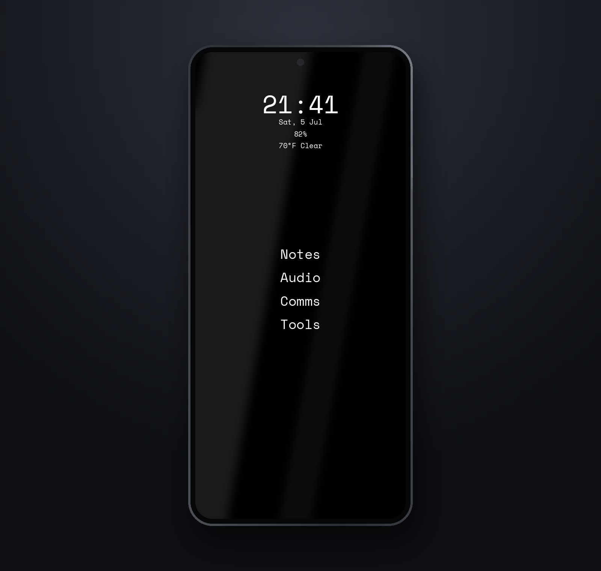

# PiercingXX Mobile Shell

**A minimalist Wayland shell for Linux phones — text-first, gesture-driven, and fully functional as a daily phone.**

> **"WM" is the name, not the architecture.** Piercing WM is in fact a *shell*: the phoc compositor does the actual window management, and Piercing WM provides every surface drawn over it (home, lock screen, shade, switcher, call UI, …) — the same relationship Phosh has to phoc.

Most mobile Linux shells try to be a desktop squeezed onto a phone. Piercing WM goes the other way: a quiet, monochrome, text-first home screen with no icon grids, no visual noise, and nothing between you and what you want to launch. Everything is driven by simple, natural gestures — swipe for the drawer, the shade, the switcher — and everything a phone must do (calls, SMS, notifications, quick settings, lock screen) is a first-class surface.

<p align="center">
  
</p>

The default home screen: AMOLED black, centered, Space Mono. A clock, the essentials, and your apps — nothing else.

<table>
<tr><td><b>Product</b></td><td>Piercing WM — compositor session + GTK4 layer-shell launcher</td></tr>
<tr><td><b>Design spec</b></td><td><code>design.md</code> — the full UI contract for every surface, theme, and gesture</td></tr>
<tr><td><b>Compositor</b></td><td>phoc today (all test phones ship it); Hyprland when Hyprgrass matures</td></tr>
<tr><td><b>Stack</b></td><td>Python + GTK4/libadwaita + gtk4-layer-shell, lisgd gestures, wob HUD, squeekboard keyboard (PiercingXX Colemak layouts)</td></tr>
<tr><td><b>Ecosystem</b></td><td><a href="https://github.com/PiercingXX/piercing-dots">piercing-dots</a> for the terminal/dotfile layer; <a href="https://github.com/PiercingXX/debian-mini-mod">debian-mini-mod</a> minimal-install patterns</td></tr>
</table>


Six built-in theme presets — AMOLED, Graphite, Forest, Ocean, Paper, and Mist — all solid colors, all text-first.

## Design principles

- **Minimal by default.** A clock, a handful of widgets (date, battery, weather), and your most-used apps as plain text. No icon grids anywhere.
- **Gestures, not chrome.** Swipe up for the app drawer, down for the notification shade and quick settings, sideways for the app switcher. The screen belongs to content, not controls.
- **A real phone.** Calls, dialer, SMS, notifications, lock screen, and quick settings are all first-class surfaces — this is a daily driver, not a demo.
- **Fast search.** The drawer opens with search focused; type a few letters and go.
- **Local-only customization.** Themes, fonts, layout, and gestures are configured on-device. Nothing phones home.

## What this is (and isn't)

- **It is** a launcher + shell session: home screen, app drawer, lock screen, notification shade, app switcher, quick settings, call UI, dialer, SMS — every surface a GTK4 layer-shell window over a wlroots compositor.
- **It is** device-agnostic. Phones are test targets, not the product.
- **It isn't** a distro. It installs onto whatever mobile OS the phone runs (postmarketOS, PureOS, FuriOS). Base OS is a dependency.
- **It isn't** GNOME/Phosh with a theme. No GNOME Shell, no libhandy app grid, no icon grids anywhere.

## Test devices

| Device | OS | Kernel | Role |
|---|---|---|---|
| **Fairphone 5** | postmarketOS (Alpine) | mainline 6.15 | Primary bring-up target — image downloaded, flash pending (`devices/fairphone-5/`) |
| **Librem 5** | PureOS | mainline | Second target — already runs phoc/Phosh, ideal for replacing Phosh in place (`devices/librem-5/`) |
| **Furi Phone FLX1** | FuriOS (Debian) | Halium-based | Third target — daily-driver-grade telephony incl. VoLTE (`devices/furiphone-flx1/`) |

All three ship a phoc-based stack, so one launcher codebase covers the whole matrix. Device directories hold only flash/setup scripts and hardware notes.

## Repo layout

```
launcher/          ← the product: GTK4 layer-shell launcher + session files
  src/             ← all surfaces (window.py, lock_screen.py, notification_shade.py, …)
  data/            ← phoc.ini, session files, systemd user service
design.md          ← the UI spec — every surface, theme, and gesture
todo.md            ← the build plan
scripts/           ← piercing-dots bootstrap + shared device setup helpers
devices/           ← per-phone flash scripts and hardware notes (not the product)
```

## Read first

1. `design.md` — what we're building (the UI spec)
2. `todo.md` — how we get there
3. `launcher/README.md` — code layout, local run, deploy

## License

GPL-3.0.
